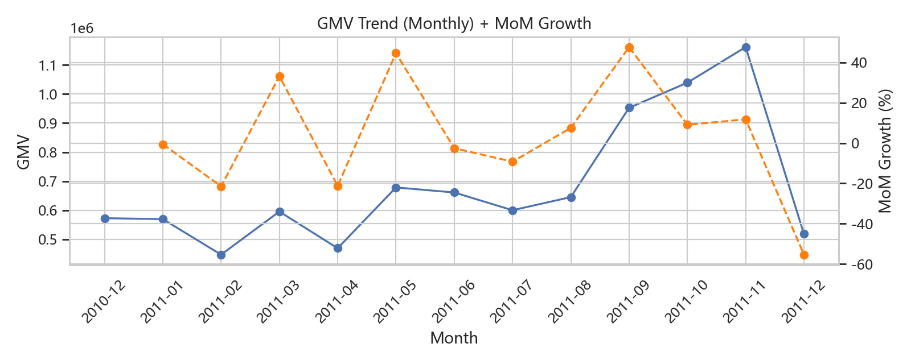
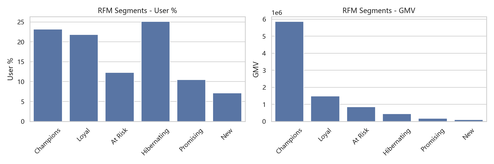
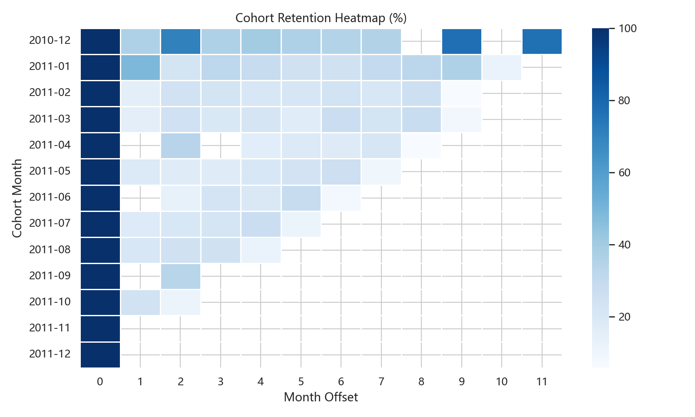
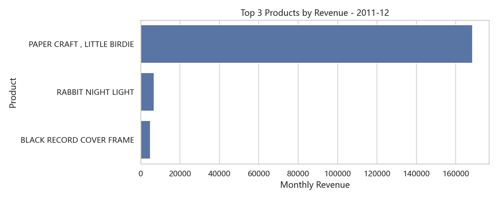

🛒 E-Commerce Data Warehouse & Analytics (UK Online Retail)

一个基于 Kaggle UK Online Retail CSV 构建的轻量级电商数仓 + 分析项目，覆盖 **Python ETL、SQLite/SQL 分析、指标沉淀（ADS）与可视化**，用于展示数据处理能力与产品化思维（指标体系 → 洞察 → 行动建议）。

🎯 项目定位（产品主体）
- **目标**：把“原始交易明细”沉淀为可复用的业务指标与分析结果，回答增长分析的核心问题：**增长来自哪里、用户价值结构如何、留存/复购是否健康、应该优先做哪些运营动作**。
- **面向对象（用户画像）**：业务/增长分析师、运营、商品/营销负责人（需要可解释的指标口径与可落地的行动建议）。
- **最终交付物**：
  - `data/ecommerce.db`：SQLite 数仓（ODS/DWD/ADS）
  - `scripts/sql/*.sql`：可复用的分析 SQL（窗口函数/RFM/留存/复购）
  - `analysis/analysis.ipynb`：可视化与探索分析示例
  - `docs/metrics.md`：指标字典（口径与计算方式）

🏗 项目架构
本项目遵循标准的数仓分层设计，确保了数据的可追溯性和逻辑解耦：

ODS (Original Data Store): 贴源层，存储原始 Kaggle 电商数据。

DWD (Data Warehouse Detail): 明细层，进行数据清洗（处理空值、去重、格式化字符串）。

ADS (Application Data Service): 应用层，存储最终的业务分析指标（如 Top 10 客户、每小时销售分布）。

📂 目录结构
Plaintext
ecommerce_data_warehouse/
├── data/
│   ├── data.csv          # 原始数据集 (Source)
│   └── ecommerce.db      # 自动生成的 SQLite 数据库 (Warehouse)
├── scripts/
│   ├── load_data.py          # ETL：CSV -> ODS/DWD
│   ├── run_sql_analysis.py   # 运行核心分析并写入 ADS 表
│   └── sql/                  # 独立 SQL 分析脚本（窗口函数/RFM/留存/复购）
├── analysis/
│   └── analysis.ipynb    # 分析手册：负责 ADS 层生成及可视化
└── README.md
🚀 技术栈
语言: Python 3.x

数据库: SQLite (SQL)

库: Pandas (数据处理), Matplotlib/Seaborn (可视化)

🚀 快速开始

1) 生成数仓（ODS/DWD）

```bash
pip install -r requirements.txt
py scripts/load_data.py
```

将生成（或覆盖）SQLite 文件 `data/ecommerce.db`，并写入：
- `ods_ecommerce`：原始明细（贴源）
- `dwd_ecommerce`：清洗后的交易明细（用于分析）

（可选）运行数据质量检查（建议对外展示时保留）

```bash
py scripts/data_quality_check.py
```

2) 生成 ADS 指标表（SQL 分析结果落库）

```bash
py scripts/run_sql_analysis.py
```

会写入以下 ADS 表（可直接用 BI/Notebook 做可视化）：
- `ads_monthly_top3_products`：每月 Top3 商品（窗口函数）
- `ads_monthly_gmv_mom`：GMV 月环比（LAG）
- `ads_rfm_segments`：RFM 分群汇总（NTILE）
- `ads_cohort_retention`：Cohort 留存表

3) 打开 `analysis/analysis.ipynb` 查看可视化示例与探索分析。

📈 可对外展示的分析主题（简历/作品集友好）
- **指标体系（产品视角）**：GMV、AOV（客单价）、复购率、新客/老客 GMV 拆分、留存（Cohort）、用户分层（RFM）
- **SQL 能力**：窗口函数（ROW_NUMBER/LAG/Running Total）、分群 NTILE、留存月偏移计算、复购率/分桶统计
- **数据处理能力**：空值/异常值处理（CustomerID 缺失、Quantity/UnitPrice 非正）、字段标准化（商品名清洗）、可复现的落库流程

📚 指标口径（建议面试/作品集重点讲）
详见 `docs/metrics.md`，包括：
- GMV（交易额）、AOV（客单价）、复购率、新客/老客 GMV、RFM、Cohort 留存
- 清洗/过滤规则（CustomerID 缺失、Quantity/UnitPrice 非正等）对指标的影响说明

📊 作品集展示（Notebook 输出）
运行完 ETL 与 ADS 后，打开 `analysis/analysis.ipynb`，可以直接看到以下“可展示图表”（全部从 ADS 表读取，口径稳定）：
- GMV 月趋势 + 环比（`ads_monthly_gmv_mom`）
- RFM 分群人数占比 & GMV 贡献（`ads_rfm_segments`）
- Cohort 留存热力图（`ads_cohort_retention`）
- 最新月份 Top3 商品（`ads_monthly_top3_products`）

（可选）导出 PNG 图片用于 GitHub README 展示：

```bash
py scripts/export_portfolio_figures.py
```

导出后图片位置：`analysis/figures/*.png`

### 图表预览





- 基于 Kaggle UK Online Retail 数据，使用 **Python + SQLite** 搭建 ODS/DWD/ADS 分层数仓，沉淀核心业务指标与分析宽表
- 使用 **窗口函数、RFM 分群、Cohort 留存、复购率/客单价分布** 等方法定位增长来源与用户价值结构，并将结果落库供可视化消费

🧠 洞察到动作（产品化表达模板）
- **增长拆解**：按月 GMV 与环比 → 再拆新客/老客 GMV（判断是拉新驱动还是复购驱动）
- **用户经营**：用 RFM 分群量化“高价值/忠诚/沉睡/流失高价值”占比与 GMV 贡献
- **留存健康度**：Cohort 留存曲线定位首购后流失节点（月偏移 M1/M2…）
- **行动建议输出**（示例写法）：
  - 对“高价值/忠诚用户”：会员/满减门槛/专属券，提高复购与客单
  - 对“流失高价值用户”：按 Recency 分层做召回，监控召回转化与 ROI
  - 若“新客 GMV 高但老客 GMV 低”：优化首购后 7/14/30 天触达链路与复购激励
